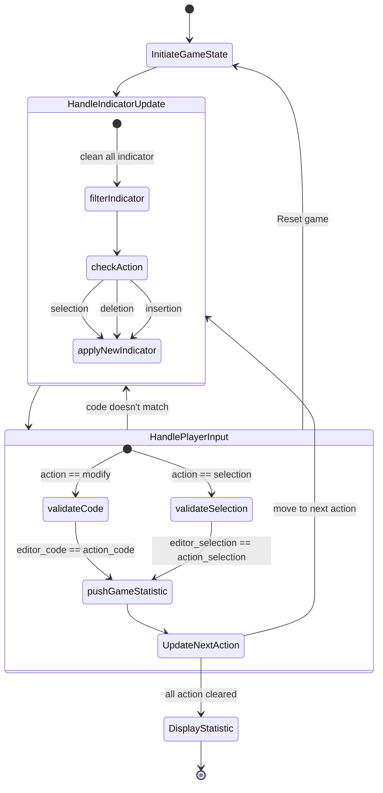

## Game State Machine

These state machine diagram explain briefly about the core gamification mechanic used in this game.

The game component could be found in `client/src/components/module/game-editor.tsx`,
Here's list of file that correspond to each state explained in diagram above:

**1. `InitiateGameState`**

- `client/src/components/module/game-reducer.tsx`, list of state that used in the game component.
  - `initializeGameState`: begin or reset game state.
  - `game_reducer`: The states reducer for `useReducer` used in game components.

**2. `HandleIndicatorUpdate`**

- `client/src/lib/game/cm-update-view.ts`, handle the game indicator for the `Codemirror` library.

**3. `validateCode` and `validateSelection`**

- `client/src/components/module/game-action-checker.ts`, validating the input of user to desired outcomes.

**4. DisplayStatistic**

- `client/src/components/module/game-statistic-chart.tsx`, display the final statistic of player's game result.
